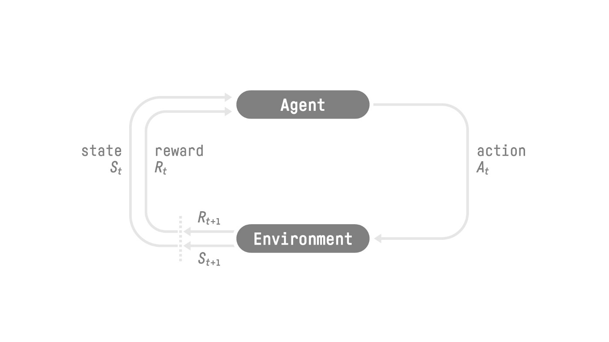
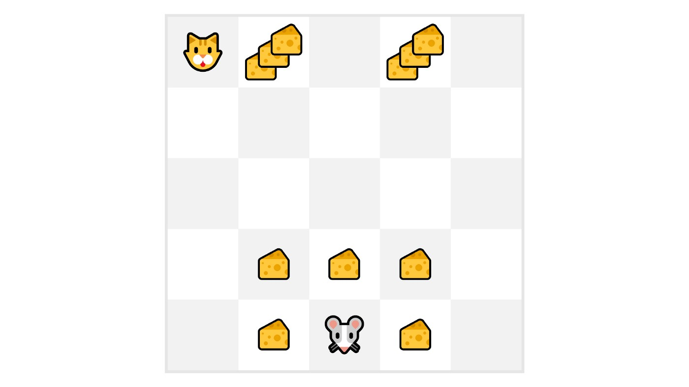

Deep RL is a type of Machine Learning where an agent learns how to behave in an environment by performing actions and seeing the results.

Reinforcement learning is a framework for solving control tasks (also called decision problems) by building agents that learn from the environment by interacting with it through trial and error and receiving rewards (positive or negative) as unique feedback.

Markov Decision Process implies that the model only needs the current state to make a decision and not the history of all states and actions previously taken.

As we can see in the diagram, it’s more probable to eat the cheese near us than the cheese close to the cat (the closer we are to the cat, the more dangerous it is).

Consequently, the reward near the cat, even if it is bigger (more cheese), will be more discounted since we’re not really sure we’ll be able to eat it.

To discount the rewards, we proceed like this:

We define a discount rate called *gamma*. It must be between 0 and 1. Most of the time between 0.95 and 0.99.
The **larger the gamma**, the **smaller the discount**. This means our agent cares more about the long-term reward.
On the other hand, the **smaller the gamma**, the **bigger the discount**. This means our agent cares more about the short term reward (the nearest cheese).

The Policy π is the brain of our Agent, it’s the function that tells us what action to take given the state we are in. So it defines the agent’s behavior at a given time.

This Policy is the function we want to learn, our goal is to find the optimal policy π*, the policy that maximizes expected return when the agent acts according to it. We find this π* through training.

